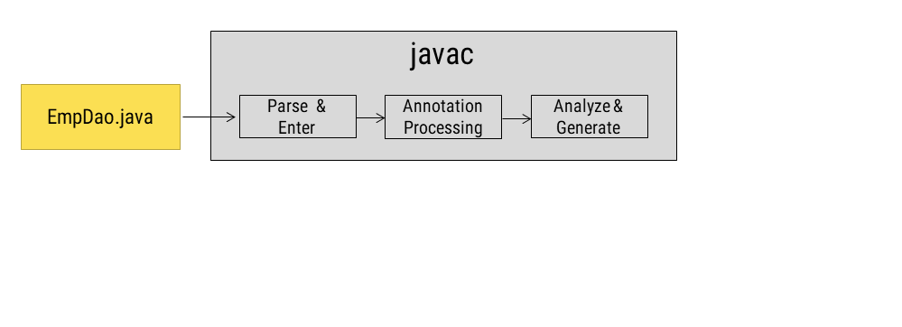
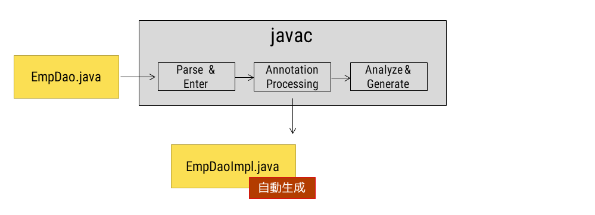
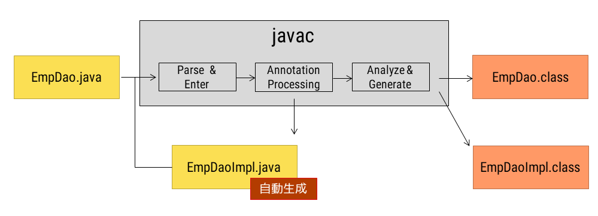
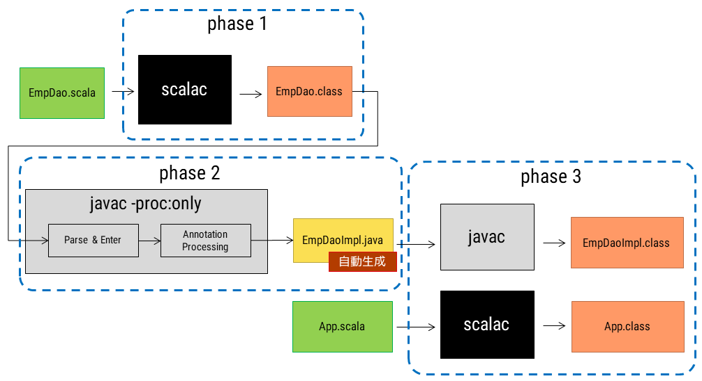
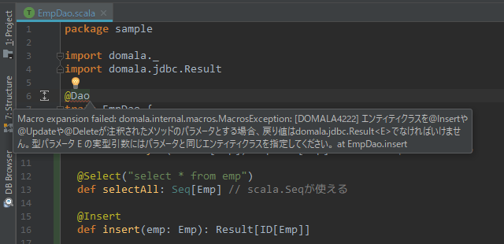
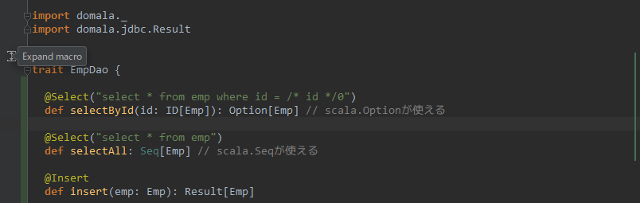
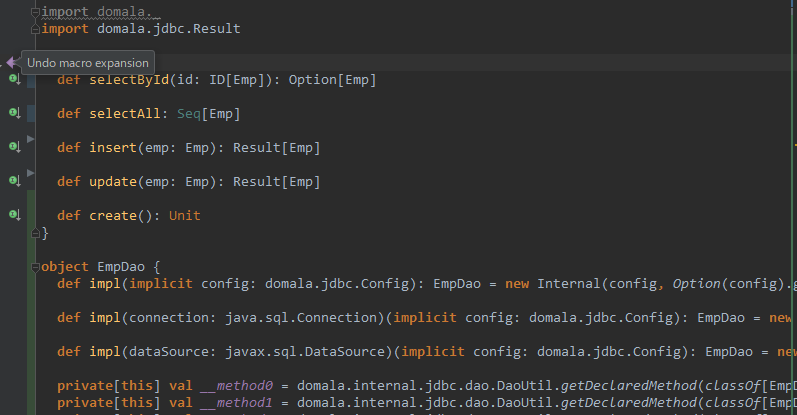

Doma on Scala
------
Doma勉強会 2017


自己紹介
------
- 細西 伸彦 [@bake_nezummi](https://twitter.com/bake_nezumi)
- 福岡のSier勤務
- 受託業務アプリ開発 / パッケージ開発
- 主にJava, 最近は若干Scala
- Doma歴5年くらい （S2Dao含めると10年強）


なぜScalaからDomaを使おうとしたのか
-----
- 現在チームではPlay-Java + Doma2がメイン構成<!-- .element: class="fragment" -->

⇒ Scalaに移行したい<!-- .element: class="fragment" -->

- 他メンバーにPlay, Scala, ＋他のなにかのOR-Mapperを全て覚えさせるのはハードルが高いが、使い慣れたDomaを使えるのであれば移行がスムーズになるのではと思った<!-- .element: class="fragment" -->


今日は3つのパターンのDoma + Scalaの

組み合わせ方を段階的に説明します


Step1
----- 
Doma関連クラスはJavaで作り、利用をScalaで<!-- .element: class="fragment" -->

Step2
-----
Doma関連クラスもScalaで作る<!-- .element: class="fragment" -->

Step3
-----
Domala<!-- .element: class="fragment" -->


Step1～3では下記のJavaアプリをScalaにします

```java
public class SampleApp0 {
  private static final EmpDao dao = new EmpDaoImpl();
  public static void main(String[] args) {
    AppConfig.singleton().getTransactionManager().required(() -> {
      // create table & insert
      dao.create();
      final List<Result<Emp>> inserted = Stream.of(
        new Emp(ID.of(-1), "scott", 10, -1),
        new Emp(ID.of(-1), "allen", 20, -1)
      ).map(dao::insert)
        .collect(Collectors.toList());
      System.out.println(inserted);

      // idが2のEmpのageを +1 にupdate
      final Optional<Result<Emp>> updated =
        dao
          .selectById(ID.of(2))
          .map(Emp::grawOld)
          .map(dao::update);
      System.out.println(updated);

      dao.selectAll().forEach(System.out::println);
      // =>
      //   Emp(id=ID(1), name=scott, age=10, version=1)
      //   Emp(id=ID(2), name=allen, age=21, version=2)
    });
  }}
```


Domain  (Java)

```java
@Domain(valueType = long.class, factoryMethod = "of")
public final class ID<ENTITY> implements Serializable {
  private final long value;

  private ID(final long value) {
    this.value = value;
  }

  public long getValue() {
    return value;
  }

  public static <ENTITY> ID<ENTITY> of(final long value) {
    return new ID<>(value);
  }

  @Override
  public boolean equals(Object obj) {
    return obj instanceof ID && ((ID) obj).value == value;
  }

  @Override
  public String toString() {
    return (String.format("ID(%d)", value));
  }

  private static final long serialVersionUID = 1L;

}
```


Entity (Java)

```java
@Entity(immutable = true)
public class Emp implements Serializable {
  @Id
  @GeneratedValue(strategy = GenerationType.SEQUENCE)
  @SequenceGenerator(sequence = "emp_id_seq")
  final ID<Emp> id;
  final String name;
  final int age;
  @Version
  final int version;
  public Emp(ID<Emp> id, String name, int age, int version) {
    this.id = id;
    this.name = name;
    this.age = age;
    this.version = version;
  }
  /* 年齢 +1 */
  public Emp grawOld() {
    return new Emp(id, name, age + 1, version);
  }

  @Override
  public boolean equals(Object obj) {
    if(obj instanceof Emp) {
      Emp emp = ((Emp) obj);
      return emp.id.equals(id) && emp.name.equals(name) && emp.age == age && emp.version == version;
    } else {
      return false;
    }
  }

  @Override
  public String toString() {
    return (String.format("Emp(id=%s, name=%s, age=%d, version=%d)", id, name, age, version));
  }

  private static final long serialVersionUID = 1L;

}
```


Dao (Java)

```java
@Dao(config = AppConfig.class)
public interface EmpDao {
  @Select
  Optional<Emp> selectById(ID<Emp> id);

  @Select
  List<Emp> selectAll();

  @Insert
  Result<Emp> insert(Emp emp);

  @Update
  Result<Emp> update(Emp emp);

  @Script
  void create();

}
```


SQL

selectById.sql<!-- .element: style="font-size:70%; text-align:left; margin-left: 30px" -->

```sql
select * from emp where id = /* id */0
```
selectAll.sql<!-- .element: style="font-size:70%; text-align:left; margin-left: 30px" -->

```sql
select * from emp
```
create.script<!-- .element: style="font-size:70%; text-align:left; margin-left: 30px" -->

```sql
create table emp(
    id int not null primary key,
    name varchar(20) not null,
    age int not null,
    version int not null
);
create sequence emp_id_seq start with 1;
```


Step1
----- 
Doma関連クラスはJavaで作り、利用をScalaで


Step1 project構成

```
project-root/
 - src/
    - main/
       - java/      #Doma関連クラスのソース
       - scala/     #Dao利用クラスのソース
       - resources/ #SQLファイル
 - target/
    - scala-2.12/
       - classes/   #ビルド結果の出力ディレクトリ
 - build.sbt
```
\* 上記はsbt標準のプロジェクト構成<!-- .element: style="font-size:60%; text-align:left; margin-left: 30px" -->

\* sbtはscalaのビルドツール<!-- .element: style="font-size:60%; text-align:left; margin-left: 30px" -->


Step1 build.sbt<span style="font-size:60%">*1</span>（初版 要修正）
```scala
lazy val root = (project in file(".")).
  settings(
    inThisBuild(List(
      scalaVersion := "2.12.4",
      version      := "0.1.0-SNAPSHOT"
    )),
    name := "scala-doma-sample1",
    libraryDependencies ++= Seq(
      "org.seasar.doma" % "doma" % "2.19.0",
      "com.h2database" % "h2" % "1.4.193",
      scalaTest % Test
    )
  )
```
<div style="text-align:left; margin-left: 30px">
<span style="font-size:50%">*1</span><span style="font-size:60%">build.sbtはsbtの設定ファイル</span>
</div >


Domain, Enity, Dao及びSQLはそのまま使います

アプリをJavaからScalaにします


Step1 Daoの利用 (Scala)

```scala
object SampleApp1 extends App {
  lazy val dao: EmpDao = new EmpDaoImpl()
  AppConfig.singleton.getTransactionManager.required({ () =>
    // create table & insert
    dao.create()
    val inserted = Seq(
      new Emp(ID.of(-1), "scott", 10, -1),
      new Emp(ID.of(-1), "allen", 20, -1)
    ).map(dao.insert)
    println(inserted)

    // idが2のEmpのageを +1 にupdate
    val updated =
      dao
        .selectById(ID.of(2))
        .map[Emp](_.grawOld) // Optional#mapは型推論が効かないため明示する必要がある
        .map[Result[Emp]](dao.update)
    println(updated)

    dao.selectAll().forEach(println)
    // =>
    //   Emp(id=ID(1), name=scott, age=10, version=1)
    //   Emp(id=ID(2), name=allen, age=21, version=2)
  }: Runnable)
}
```
\* _.grawOld は(x) => x.grawOld の省略記法<!-- .element: style="font-size:60%; text-align:left; margin-left: 30px" -->


Step1 compile & run

そのままではコンパイルが失敗<!-- .element: style="font-size:80%; text-align:left; margin-left: 30px" -->

```bash
sbt:scala-doma-sample1> compile
[error] C:\scala-doma-sample1\src\main\scala\sample\SampleApp1.scala:7:30:
 not found: type EmpDaoImpl
[error]   lazy val dao: EmpDao = new EmpDaoImpl()
[error]                              ^
[error] one error found
[error] (compile:compileIncremental) Compilation failed
```

Javaから先にコンパイルする指定がいる<!-- .element: style="font-size:80%; text-align:left; margin-left: 30px" -->

⇒ build.sbtに追記<!-- .element: style="font-size:80%; text-align:left; margin-left: 30px" -->
```scala
compileOrder := CompileOrder.JavaThenScala
```


Step1 compile & run

再コンパイル<!-- .element: style="font-size:80%; text-align:left; margin-left: 30px" -->

```bash
sbt:scala-doma-sample1> compile
[error] C:\scala-doma-sample1\src\main\java\sample\EmpDao.java:19:1:
 エラー: [DOMA4019] ファイル[META-INF/sample/EmpDao/selectById.sql]が
 クラスパスから見つかりませんでした。ファイルの絶対パスは
 "C:\scala-doma-sample1\target\scala-2.12\classes\META-INF\sample\EmpDao\selectById.sql"です。
[error]   Optional<Emp> selectById(ID<Emp> id);
[error]                 ^^
```

コンパイルより前にsqlファイル（resources）を出力ディレクトリにコピーしないといけない<!-- .element: style="font-size:80%; text-align:left; margin-left: 30px" -->

⇒ build.sbtに追記<!-- .element: style="font-size:80%; text-align:left; margin-left: 30px" -->

```scala
compile in Compile := ((compile in Compile) dependsOn (copyResources in Compile)).value
```


Step1 compile & run
```bash
sbt:scala-doma-sample1> compile
[info] Compiling 1 Scala source and 4 Java sources to C:\scala-doma-sample1\target\scala-2.12\classes ...
[info] Done compiling.
[success] Total time: 5 s, completed 2017/12/06 9:54:14
```
```bash
sbt:scala-doma-sample1> run
...
select * from emp
12 06, 2017 9:55:26 午前 sample.EmpDaoImpl selectAll
情報: [DOMA2221] EXIT   : クラス=[sample.EmpDaoImpl], メソッド=[selectAll]
Emp(id=ID(1), name=scott, age=10, version=1)
Emp(id=ID(2), name=allen, age=21, version=2)
12 06, 2017 9:55:26 午前 org.seasar.doma.jdbc.tx.LocalTransaction commit
情報: [DOMA2067] ローカルトランザクション[1724208677]をコミットしました。
12 06, 2017 9:55:26 午前 org.seasar.doma.jdbc.tx.LocalTransaction commit
情報: [DOMA2064] ローカルトランザクション[1724208677]を終了しました。
[success] Total time: 2 s completed 2017/12/06 9:55:27
```
OK


Step1 build.sbt（完成版）

```diff
lazy val root = (project in file(".")).
  settings(
    inThisBuild(List(
      scalaVersion := "2.12.4",
      version      := "0.1.0-SNAPSHOT"
    )),
    name := "scala-doma-sample1",
    libraryDependencies ++= Seq(
      "org.seasar.doma" % "doma" % "2.19.0",
      "com.h2database" % "h2" % "1.4.193",
      scalaTest % Test
    )
  )

+ // for Doma annotation processor
+ compileOrder := CompileOrder.JavaThenScala
+ compile in Compile := ((compile in Compile) dependsOn (copyResources in Compile)).value
```


Step1の課題
 - アプリを作るのに2言語必要（Java, Scala）<!-- .element: class="fragment" -->
 - 特にコレクションが混ざるのがつらい<!-- .element: class="fragment" -->
 


Step2
-----
Doma関連クラスもScalaで作る


Step2 Entity (Scala)

```scala
// Doma2ではフィールドにアノテーションを付ける必要があるが
// コンストラクタパラメータに対してアノテーションを付けると
// パラメータに対してのみ有効になる
// 下記のように@fieldと明示することで自動的に作られる同名の
// 状態フィールドに対し アノテーションを有効にできる
// http://www.scala-lang.org/api/current/scala/annotation/meta/index.html
@Entity(immutable = true)
case class Emp(
  @(Id @field)
  @(GeneratedValue @field)(strategy = GenerationType.SEQUENCE)
  @(SequenceGenerator @field)(sequence = "emp_id_seq")
  id: ID[Emp],
  name: String,
  age: Int,
  @(Version @field)
  version: Int
) {
  def growOld: Emp = this.copy(age = this.age + 1)
}

```


Step2 Domain  (Scala)

```scala
// Domainクラスにはvalueのgetter（getValue）が必要
// @scala.beans.BeanPropertyはgetterとsetterを作ってくれる
@Domain(valueType = classOf[Long])
case class ID[ENTITY](
  @BeanProperty value: Long)
```


case classについて

EntityとDomainですが、アノテーションが少し増えてしまいましたが実装はだいぶ減りました<!-- .element: style="font-size:80%; text-align:left; margin-left: 30px" -->

Scalaではcase classと定義するとhashCode()、equals()、toString()、等がコンパイル時に自動生成されるためこの恩恵を受けています<!-- .element: style="font-size:80%; text-align:left; margin-left: 30px" -->


Step2 Dao (Scala)

```scala
// Scalaで作ったConfigはstaticメソッドを持てず
// アノテーション引数に指定できないため
// 利用者がコンストラクタパラメータで渡す
@Dao
trait EmpDao {
  @Select
  def selectById(id: ID[Emp]): Optional[Emp] // javaのOptional

  @Select
  def selectAll: java.util.List[Emp] // javaのList

  @Insert
  def insert(emp: Emp): Result[Emp]

  @Update
  def update(emp: Emp): Result[Emp]

  @Script
  def create(): Unit
}
```


Step2 Config (Scala)

```scala
object AppConfig extends Config {
  val dataSource = new LocalTransactionDataSource(
    "jdbc:h2:mem:tutorial;DB_CLOSE_DELAY=-1",
    "sa",
    null)
  val transactionManager = new LocalTransactionManager(
    dataSource.getLocalTransaction(getJdbcLogger))

  Class.forName("org.h2.Driver")

  override def getDialect: Dialect = new H2Dialect()

  override def getDataSource: DataSource = dataSource

  override def getTransactionManager: TransactionManager = transactionManager
}
```


Step2 Daoの利用 (Scala)

```scala
object SampleApp2 extends App {
  private lazy val dao: EmpDao = new EmpDaoImpl(AppConfig)
  AppConfig.getTransactionManager.required({ () =>
    // create table & insert
    dao.create()
    val inserted = Seq(
      Emp(ID[Emp](-1), "scott", 10, -1),
      Emp(ID[Emp](-1), "allen", 20, -1)
    ).map(dao.insert)
    println(inserted)

    // idが2のEmpのageを +1 にupdate
    val updated =
      dao
        .selectById(ID(2))
        .map[Emp](_.grawOld) // Optional#mapは型推論が効かないため明示する必要がある
        .map[Result[Emp]](dao.update)
    println(updated)

    dao.selectAll.forEach(println)
    // =>
    //   Emp(ID(1),scott,10,1)
    //   Emp(ID(2),allen,21,2)
  }: Runnable)

}

```


Step2 compile & run

Pluggable Annotation Processing APIでひっかかります


Pluggable Annotation Processing API

- Java標準のアノテーションマクロ

- コンパイル時に
  - アノテーションが付与されたコードの検証
  - ソースコードの自動生成

  が行える


Doma2のAnnotation Processing

EmpDao.java<!-- .element style="text-align:left;font-size:80%; margin-left:30px"-->
```java
@Dao public interface EmpDao {
    @Select List<Emp> findAll();
}
```

↓<span style="font-size:80%">コード＆SQL検証</span>

EmpDaoImpl.java<!-- .element style="text-align:left;font-size:80%; margin-left:30px"-->
```java
public class EmpDaoImpl
  extends org.seasar.doma.internal.jdbc.dao.AbstractDao
  implements EmpDao { .../* Dao実装 */ }
```


Doma2のAnnotation Processing

Emp.java<!-- .element style="text-align:left;font-size:80%; margin-left:30px"-->
```java
@Entity public classs EmpDao {
    @Id int id;
}
```
↓<span style="font-size:80%">コード検証</span>

_Emp.java<!-- .element style="text-align:left;font-size:80%; margin-left:30px"-->
```java
public final class _Emp
  extends org.seasar.doma.jdbc.entity.AbstractEntityType<Emp> {
    .../* Entityのヘルパー実装 */ }
```


Doma2のAnnotation Processingの流れ

<!-- .element: width="912" height="331" style="overflow: hidden;
    width: 912px;
    height: 331px;
    position: relative;" -->

<span style="font-size:60%">http://openjdk.java.net/groups/compiler/doc/compilation-overview/index.html </span>


Doma2のAnnotation Processingの流れ

<!-- .element: width="912" height="331" style="overflow: hidden;
    width: 912px;
    height: 331px;
    position: relative;" -->

<span style="font-size:60%">http://openjdk.java.net/groups/compiler/doc/compilation-overview/index.html </span>


Doma2のAnnotation Processingの流れ

<!-- .element: width="912" height="331" style="overflow: hidden;
    width: 912px;
    height: 331px;
    position: relative;" -->

<span style="font-size:60%">http://openjdk.java.net/groups/compiler/doc/compilation-overview/index.html </span>


Annotation Processingはjavac時に行われるが、

Doma関連クラスがScalaクラスになったため

scalacがコンパイラになり

javacがそもそも走らない


（再掲）Doma2のAnnotation Processingの流れ


EmpDao.javaがいないので

EmpDaoImpl.javaが作られない


どうしたか


ビルドを3フェーズに分けた

1. Doma関連クラスのソース(.scala)をコンパイル<!-- .element class="fragment" -->

1. Doma関連クラスの.classファイルを-proc:onlyでjavacしてAnnotation Processingのみ行う<!-- .element class="fragment" -->

1. 2.で自動生成されたソース(.java)と自動生成クラスの利用クラス(.scala)をコンパイル<!-- .element class="fragment" -->


Step2のビルドの流れ



Step2 project構成
```
project-root/
 - generate/         #自動生成先
 -repository
   - src/
      - main/
        - scala/     #Doma関連クラスのソース
        - resources/ #SQLファイル
   - target/
      - scala-2.12/
         - classes/  #Doma関連クラスのビルド結果の出力ディレクトリ
 - src/
    - main/
       - scala/      #Dao利用クラスのソース
 - target/
    - scala-2.12/
       - classes/    #Dao利用クラスのビルド結果の出力ディレクトリ
 - build.sbt
```


Step2 build.sbt

```scala
lazy val root = (project in file(".")).settings(
  inThisBuild(List(
    scalaVersion := "2.12.4",
    version      := "0.1.0-SNAPSHOT"
  )),
  name := "scala-doma-sample2",
  libraryDependencies += scalaTest % Test,
  // for Doma annotation processor
  (unmanagedSourceDirectories in Compile) += generateSourceDirectory
) dependsOn repository aggregate repository

lazy val repository = project.settings(
  inThisBuild(List(
    scalaVersion := "2.12.4",
    version      := "0.1.0-SNAPSHOT"
  )),
  name := "scala-doma-sample2-repository",
  libraryDependencies ++= Seq(
    "org.seasar.doma" % "doma" % "2.19.0",
    "com.h2database" % "h2" % "1.4.193",
    scalaTest % Test
  ),
  // for Doma annotation processor
  processAnnotationsSettings
)

lazy val processAnnotations = taskKey[Unit]("Process annotations")
lazy val generateSourceDirectory = file(".").getAbsoluteFile / "generated"

lazy val processAnnotationsSettings: Seq[Def.Setting[_]] = Seq(
  processAnnotations in Compile := {
    val classes = (unmanagedSources in Compile).value.filter(_.getPath.endsWith("scala"))
    val log = streams.value.log
    val separator = System.getProperties.getProperty("path.separator")
    val classpath = ((dependencyClasspath in Compile).value.files mkString separator) + separator + (classDirectory in Compile).value.toString
    if (classes.nonEmpty) {
      log.info("Processing annotations ...")
      deleteFiles(generateSourceDirectory)
      val cutSize = (scalaSource in Compile).value.getPath.length + 1
      val classesToProcess = classes.map(_.getPath.substring(cutSize).replaceFirst("\\.scala", "").replaceAll("[\\\\/]", ".")).mkString(" ")
      val directory = (classDirectory in Compile).value
      val command = s"javac -cp $classpath -proc:only -XprintRounds -d $directory -s $generateSourceDirectory $classesToProcess"
      executeCommand(command, "Failed to process annotations.", log)
      log.info("Done processing annotations.")
    }
  },
  processAnnotations in Compile := ((processAnnotations in Compile) dependsOn (compile in Compile)).value,
  copyResources in Compile := Def.taskDyn {
    val copy = (copyResources in Compile).value
    Def.task {
      (processAnnotations in Compile).value
      copy
    }
  }.value
)

def deleteFiles(targetDirectory: File): Unit = {
  def delete(f: File): Unit =
    if (f.isFile)
      f.delete()
    else
      f.listFiles.toList.foreach(delete)
  if(targetDirectory.exists)
    delete(targetDirectory)
  else
    targetDirectory.mkdir()
}

def executeCommand(command: String, errorMessage: => String, log: Logger): Unit = {
  val process = java.lang.Runtime.getRuntime.exec(command)
  printInputStream(process.getErrorStream, log)
  if (process.waitFor() != 0) {
    log.error(errorMessage)
    sys.error("Failed running command: " + command)
  }
}

def printInputStream(is: scala.tools.nsc.interpreter.InputStream, log: Logger): Unit = {
  val br = new java.io.BufferedReader(new java.io.InputStreamReader(is))
  try {
    var line = br.readLine
    while (line != null) {
      log.info(line)
      line = br.readLine
    }
  } finally {
    br.close()
  }
}
```


Step2 compile & run
```bash
sbt:scala-doma-sample2> compile
[info] Compiling 4 Scala sources to C:\scala-doma-sample2\repository\target\scala-2.12\classes ...
[info] Done compiling.
[info] 往復1:
[info]  入力ファイル: {sample.AppConfig, sample.Emp, sample.EmpDao, sample.ID}
[info]  注釈: [scala.reflect.ScalaSignature, org.seasar.doma.Entity, org.seasar.doma.Id, org.seasar.doma.GeneratedValue, org.seasar.doma.SequenceGenerator, org.seasar.doma.Version, org.seasar.doma.Dao, org.seasar.doma.Script, org.seasar.doma.Select, org.seasar.doma.Insert, org.seasar.doma.Update, org.seasar.doma.Domain]
[info]  最後の往復: false
[info] 往復2:
[info]  入力ファイル: {sample._ID, sample._Emp, sample.EmpDaoImpl}
[info]  注釈: [javax.annotation.Generated, java.lang.SuppressWarnings, java.lang.Override]
[info]  最後の往復: false
[info] 往復3:
[info]  入力ファイル: {}
[info]  注釈: []
[info]  最後の往復: true
[info] Done processing annotations.
[info] Compiling 1 Scala source and 3 Java sources to C:\scala-doma-sample2\target\scala-2.12\classes ...
[info] Done compiling.
[success] Total time: 7 s, completed 2017/12/06 18:17:45
```
OK


Step2 compile & run
```sh
sbt:scala-doma-sample2> run
...
情報: [DOMA2221] EXIT   : クラス=[sample.EmpDaoImpl], メソッド=[selectAll]
Emp(ID(1),scott,10,1)
Emp(ID(2),allen,21,2)
12 06, 2017 6:22:19 午後 org.seasar.doma.jdbc.tx.LocalTransaction commit
情報: [DOMA2067] ローカルトランザクション[1673739243]をコミットしました。
12 06, 2017 6:22:19 午後 org.seasar.doma.jdbc.tx.LocalTransaction commit
情報: [DOMA2064] ローカルトランザクション[1673739243]を終了しました。
[success] Total time: 5 s, completed 2017/12/06 18:22:20
```
OK


Step1の課題
 - アプリを作るのに2言語必要（Java, Scala）<!-- .element: class="fragment init-visible current-visible" data-fragment-index="1"--><span style="font-size:80%">&nbsp;&nbsp;&nbsp;&nbsp;&nbsp;&nbsp;</span><span style="font-size:150%">&nbsp;</span><!-- .element: class="fragment init-visible current-visible" data-fragment-index="1"-->
 - <!-- .element: class="fragment init-hedden" data-fragment-index="1"-->~~アプリを作るのに2言語必要（Java, Scala）~~ <!-- .element: class="fragment init-hedden data-fragment-index="1"" --><span style="color:green;font-size:150%">✔</span><!-- .element: class="fragment init-hedden data-fragment-index="1"" -->
 - 特にコレクションが混ざるのがつらい <p class="fragment">… 変わってない</p>

Step2の課題<!-- .element: class="fragment" -->
 - @field, @BeanPropertyは見にくくなるため使いたくない<!-- .element: class="fragment" -->
 - IDEプラグインが使えない(SQLファイルに飛べない)<!-- .element: class="fragment" -->


Step3
-----
Domala


Domala
-----

いままでの課題をクリアすべく、**Scala**による**Doma2**のWrapperを作りました。

**Domala**といいます。

まだベータ版ですが年度内には1.0リリースできるように目指してます。


**Domala**の依存ライブラリ

|  |  |
|:-----------|:------|
|Scala<!-- .element: style="font-size:70%" --> | 2.12.4<!-- .element: style="font-size:70%" -->|
|Doma2<!-- .element: style="font-size:70%" --> | "org.seasar.doma" % "doma" % "2.19.0"<!-- .element: style="font-size:70%" --> |
|scalameta<!-- .element: style="font-size:70%" --> | "org.scalameta" %% "scalameta" % "1.8.0"<!-- .element: style="font-size:70%" -->|
|scalameta-paradise<!-- .element: style="font-size:70%" --> | "org.scalameta" % "paradise" % "3.0.0-M10"<!-- .element: style="font-size:70%" -->|
|scala-reflect<!-- .element: style="font-size:70%" --> |  "org.scala-lang" % "scala-reflect" % "2.12.4"<!-- .element: style="font-size:70%" -->|
|  |  |


scalameta 

- Scalaの準標準の実験的マクロライブラリ<!-- .element style="font-size:80%"-->

- ASTの構築ができる<!-- .element style="font-size:80%"-->

- scalameta paradiseと組み合わせてアノテーションマクロが組める<!-- .element style="font-size:80%"-->


scalameta paradise

- アノテーションマクロを実現するScalaのコンパイラプラグイン<!-- .element style="font-size:80%"-->

- JavaのPluggable Annotation Processing APIに近く、ASTの検証、及び改変ができる<!-- .element style="font-size:80%"-->

- 次はscalamacrosとして生まれ変わるかもしれない<!-- .element style="font-size:80%"-->

http://scala-lang.org/blog/2017/10/09/scalamacros.html<!-- .element style="font-size:80%"-->


scala-reflect

- こちらもScalaの準標準の実験的マクロライブラリ<!-- .element style="font-size:80%"-->

- 歴史的に言うとscala-reflectがマクロv1, scalametaがマクロv2<!-- .element style="font-size:80%"-->

- scalameta paradiseのアノテーションマクロはアノテーションがつけられた対象のASTの情報のみしか現状取得できない。（型の詳細情報が取得できない）<!-- .element style="font-size:80%"-->

- このscala-reflectはコンパイル時のクラスローダーミラーが参照できるため大体なんでもできる（型の判定、定義メソッドの取得、ASTの構築、など）<!-- .element style="font-size:80%"-->

- ただし難解<!-- .element style="font-size:80%"-->


**Domala**でのマクロの利用用途

- scalameta / scalameta paradise
  - アノテーション対象の構文検証
  - Dao実装、Entityヘルパーなどの自動生成

- scala-reflect
  - scalametaでは判定できない型の検証
  - 例えばIN句に渡されるパラメータはIterableのサブタイプであり、かつその中身はSQLにマッピングできる型であるか、のような検証


**Domala**のアノテーション

| Doma2 |  | Domala |
|:-----------|:------:|:------------|
| Entity | ⇒ | domala.Entity |
| Domain | ⇒ | domala.Holder<span style="font-size:50%">*1</span> |
| Dao    | ⇒ | domala.Dao |

その他のorg.seasar.domaパッケージ内のアノテーションはdomala.XXとして同様に利用できます

(0.1.0-beta.7ではストアド系は未実装）

<span style="font-size:50%">*1</span><span style="font-size:70%">Doma3からDomainはHolderに名前が変わるためDomalaも倣いました</span>


Domalaの利用例
-----


Domala project構成

```
project-root/
 - src/
    - main/
       - scala/     #Doma関連クラスのソース, Dao利用クラスのソース
 - target/
    - scala-2.12/
       - classes/   #ビルド結果の出力ディレクトリ
 - build.sbt
```


Domala build.sbt
```scala
lazy val root = (project in file(".")).settings(
  inThisBuild(List(
    scalaVersion := "2.12.4",
    version      := "0.1.0-SNAPSHOT"
  )),
  name := "scala-doma-sample3",
  libraryDependencies ++= Seq(
    "com.github.domala" %% "domala" % "0.1.0-beta.6",
    "com.h2database" % "h2" % "1.4.193",
    scalaTest % Test
  ),
  // for Domala annotation macro
  metaMacroSettings,
)
lazy val metaMacroSettings: Seq[Def.Setting[_]] = Seq(
  addCompilerPlugin("org.scalameta" % "paradise" % "3.0.0-M10" cross CrossVersion.full),
  scalacOptions += "-Xplugin-require:macroparadise",
  scalacOptions in (Compile, console) ~= (_ filterNot (_ contains "paradise")) // macroparadise plugin doesn't work in repl yet.
)
```


Domala Entity (Scala)

```scala
@Entity
case class Emp(
  @Id
  @GeneratedValue(strategy = GenerationType.SEQUENCE)
  @SequenceGenerator(sequence = "emp_id_seq")
  id: ID[Emp],
  name: String,
  age: Int,
  @Version
  version: Int) {
  def growOld: Emp = this.copy(age = this.age + 1)
}
```


Domala Holder (Scala)

```scala
@Holder
case class ID[ENTITY](value: Long)
```


Domala Dao (Scala)

```scala
@Dao
trait EmpDao {
  @Select("select * from emp where id = /* id */0")
  def selectById(id: ID[Emp]): Option[Emp] // scala.Optionが使える

  @Select("select * from emp")
  def selectAll: Seq[Emp] // scala.Seqが使える

  @Insert
  def insert(emp: Emp): Result[Emp]

  @Update
  def update(emp: Emp): Result[Emp]

  @Script("""
  create table emp(
    id int not null primary key,
    name varchar(20),
    age int,
    version int not null
  );
  create sequence emp_id_seq start with 1;
  """)
  def create(): Unit

}
```


Scalaはヒアドキュメント記述ができるため、DomalaではSQLファイルは使わずアノテーションパラメータのリテラル文字列でSQLを記述します<!-- .element style="font-size:80%"-->
```scala
  @Select("""
  select
    e.id,
    e.name,
    e.dept_id,
    d.name as dept_name
  from
    emp e
    inner join
    dept d
    on (e.dept_id = d.id)
  where
    e.id = /*id*/0
  """)
  def selectWithDeptById(id: ID[Emp]): Option[EmpDept]
```


Domala Daoの利用 (Scala)

```scala
object SampleApp3 extends App {
  private implicit lazy val config: Config = AppConfig
  private lazy val dao: EmpDao = EmpDao.impl
  Required {
    // create table & insert
    dao.create()
    val inserted = Seq(
      Emp(ID(-1), "scott", 10, -1),
      Emp(ID(-1), "allen", 20, -1)
    ).map(dao.insert)
    println(inserted)

    // idが2のEmpのageを +1 にupdate
    val updated =
      dao
        .selectById(ID(2))
        .map(_.growOld) // Optionなので型推論が働く
        .map(dao.update)
    println(updated)

    dao.selectAll.foreach(println)
    // =>
    //   Emp(ID(1),scott,10,1)
    //   Emp(ID(2),allen,21,2)
  }

}
```


implicit parameterについて

```
private implicit lazy val config: Config = AppConfig
```

Scalaではこのようにimplicitと宣言されたオブジェクトは、スコープ内のimplicit parameterを持つ関数に自動的に渡されます<!-- .element style="font-size:80%"-->

Domalaでは、<!-- .element style="text-align:left;font-size:80%"-->

- XXDao.impl(Daoのファクトリメソッド)<!-- .element style="font-size:80%"-->
- Required   (Config#getTransactionManager#requiredの糖衣構文)<!-- .element style="font-size:80%"-->

などでConfigトレイトの実装オブジェクトをimplicit parameterとして受け取るようにしています<!-- .element style="font-size:80%"-->


Javaとのdiff
```diff
- private static final EmpDao dao = new EmpDaoImpl();
+ private implicit lazy val config: Config = AppConfig
+ private lazy val dao: EmpDao = EmpDao.impl
- AppConfig.singleton().getTransactionManager().required(() -> {
+   Required {
-   dao.create();
+   dao.create()
-   final List<Result<Emp>> inserted = Stream.of(
+   val inserted = Seq(
-     new Emp(ID.of(-1), "scott", 10, -1),
+     Emp(ID(-1), "scott", 10, -1),
-     new Emp(ID.of(-1), "allen", 20, -1)
+     Emp(ID(-1), "allen", 20, -1)
-   ).map(dao::insert)
-     .collect(Collectors.toList());
+   ).map(dao.insert)
-   System.out.println(inserted);
+   println(inserted)
```


Javaとのdiff
```diff
-   final Optional<Result<Emp>> updated =
+   val updated =
      dao
-       .selectById(ID.of(2))
+       .selectById(ID(2))
-       .map(Emp::grawOld)
+       .map(_.growOld)
-       .map(dao::update);
+       .map(dao.update)
-   System.out.println(updated);
+   println(updated)
-   dao.selectAll().forEach(System.out::println);
+   dao.selectAll.foreach(println)
  }
```
そんなに変わってない。。気もしますが逆に<!-- .element style="font-size:80%"-->

Javaユーザーは違和感なくScala & Domalaを使えるのではと<!-- .element style="font-size:80%"-->

考えてます！<!-- .element style="font-size:80%"-->


Domala compile & run
```bash
sbt:scala-doma-sample3> compile
[info] Updating {file:/C:/Users/19990013/Documents/@E_Scala/scala-doma-sample3/}root...
[info] Done updating.
[info] Compiling 5 Scala sources to C:\Users\19990013\Documents\@E_Scala\scala-doma-sample3\target\scala-2.12\classes ...
[info] Done compiling.
[success] Total time: 6 s, completed 2017/12/07 21:32:55
```

```bash
sbt:scala-doma-sample3> run
...
select * from emp
12 07, 2017 9:34:16 午後 sample.EmpDao selectAll
情報: [DOMA2221] EXIT   : クラス=[sample.EmpDao], メソッド=[selectAll]
Emp(ID(1),scott,10,1)
Emp(ID(2),allen,21,2)
12 07, 2017 9:34:16 午後 org.seasar.doma.jdbc.tx.LocalTransaction commit
情報: [DOMA2067] ローカルトランザクション[1853944763]をコミットしました。
12 07, 2017 9:34:16 午後 org.seasar.doma.jdbc.tx.LocalTransaction commit
情報: [DOMA2064] ローカルトランザクション[1853944763]を終了しました。
[success] Total time: 2 s, completed 2017/12/07 21:34:17
```


Step1の課題
 - ~~アプリを作るのに2言語必要（Java, Scala）~~ <span style="color:green;font-size:150%">✔</span>
 - 特にコレクションが混ざるのがつらい<!-- .element: class="fragment init-visible current-visible" data-fragment-index="1"--><span style="font-size:80%">&nbsp;&nbsp;&nbsp;&nbsp;&nbsp;&nbsp;</span><span style="font-size:150%">&nbsp;</span><!-- .element: class="fragment init-visible current-visible" data-fragment-index="1"-->
 - <!-- .element: class="fragment init-hedden" data-fragment-index="1" -->~~特にコレクションが混ざるのがつらい~~<!-- .element: class="fragment init-hedden" data-fragment-index="1" --><span style="color:green;font-size:150%">✔</span><!-- .element: class="fragment init-hedden" data-fragment-index="1" -->

Step2の課題
 - @field, @BeanPropertyは見にくくなるため使いたくない<!-- .element: class="fragment init-visible  current-visible" data-fragment-index="2"--><span style="font-size:80%">&nbsp;&nbsp;&nbsp;&nbsp;&nbsp;&nbsp;</span><span style="font-size:150%">&nbsp;</span><!-- .element: class="fragment init-visible current-visible" data-fragment-index="2"-->
 - <!-- .element: class="fragment init-hedden" data-fragment-index="2"-->~~@field, @BeanPropertyは見にくくなるため使いたくない~~<!-- .element: class="fragment init-hedden" data-fragment-index="2"--><span style="color:green;font-size:150%">✔</span><!-- .element: class="fragment init-hedden" data-fragment-index="2" -->
 - IDEプラグインが使えない(SQLファイルに飛べない)<!-- .element: class="fragment init-visible  current-visible" data-fragment-index="3"--><span style="font-size:80%">&nbsp;&nbsp;&nbsp;&nbsp;&nbsp;&nbsp;</span><span style="font-size:150%">&nbsp;</span><!-- .element: class="fragment init-visible current-visible" data-fragment-index="3"-->
 - <!-- .element: class="fragment init-hedden" data-fragment-index="3"-->~~IDEプラグインが使えない(SQLファイルに飛べない)~~<!-- .element: class="fragment init-hedden" data-fragment-index="3"--><span style="color:green;font-size:150%">✔</span><!-- .element: class="fragment init-hedden" data-fragment-index="3" -->


やっと全てScalaでDomaを使える環境が

できました！


DomalaとIDE
-----

IntelliJ IDEA + Scala pluginでも開発できます<!-- .element: style="font-size:80%; -->




アノテーション横の謎のボタン<!-- .element: style="font-size:80%; -->



押すとマクロの結果が見れます<!-- .element: style="font-size:80%; -->




DomalaでStream検索
-----

```scala
  @Select(
    "select * from emp",
    strategy = SelectType.STREAM
  )
  def selectAll[R](mapper: Stream[Emp] => R): R
```

ScalaではFunction&lt;T, R&gt;は T => Rと書けます<!-- .element: style="font-size:80%; -->


DomalaでStream検索
-----

ScalaのStreamは気を付けて書かないとメモリを逼迫するのでSelectType.ITERATORを追加してます<!-- .element: style="font-size:80%; text-align:left; margin-left: 30px" -->

toStreamでStreamに変換もできるのでこちらだけでもいいかもしれません<!-- .element: style="font-size:80%; text-align:left; margin-left: 30px" -->

```scala
  @Select(
    "select * from emp where id in /* id */()",
    strategy = SelectType.ITERATOR
  )
  def selectByIds[R](id: Seq[ID[Emp]])(mapper: Iterator[Emp] => R): R

  def selectById(id: ID[Emp]): Option[Emp] = selectByIds(Seq(id)) {
    _.toStream.headOption
  }
```


DomalaでEnum
-----

ScalaにはEnumerationという列挙型がありますが、使いにくいのでDomalaでは対応していません。代わりにsealed<span style="font-size:60%">*1</span> abstract classに@Holderを注釈して表現できます

<!-- .element: style="font-size:80%; text-align:left; margin-left: 30px" -->

```scala
@Holder
sealed abstract class Sex(value: String)
object Sex {
  object Male extends Sex("M")
  object Female extends Sex("F")
  object Other extends Sex("O")
}
```
<span style="font-size:50%">*1</span> <span style="font-size:60%">sealed: 同一ファイル内でしかサブクラスを定義できなくする修飾子</span>


DomalaのもうひとつのHolder
-----
Scalaではvalue classという実行時に参照割り当てが行われない特殊なクラスを定義できます<!-- .element: style="font-size:80%; text-align:left; margin-left: 30px" -->

value classは任意のクラスをAnyValのサブクラスにすることで定義できます<!-- .element: style="font-size:80%; text-align:left; margin-left: 30px" -->

Domalaではこのvalue classをHolderの代わりにEnitityのフィールドとして持つことができます<!-- .element: style="font-size:80%; text-align:left; margin-left: 30px" -->

```scala
// Annotation is not necessary
case class ID[ENTITY](value: Long) extends AnyVal 
```

http://docs.scala-lang.org/overviews/core/value-classes.html<!-- .element: style="font-size:70%" -->


DomalaでREPL
-----
scalameta paradiseはREPLで利用できないため、簡易Daoとしてstring interpolationを用意しています<!-- .element: style="font-size:80%; text-align:left; margin-left: 30px" -->

```sh
sbt> console
scala> import domala._
scala> implicit val config: domala.jdbc.Config = AppConfig
scala> Required(select"select * from emp".getMapList)
res0: List[Map[String,AnyRef]] = List(Map(ID -> 1, NAME -> scott, AGE -> 10, VERSION -> 1), Map(ID -> 2, NAME -> allen, AGE -> 20, VERSION -> 1))

scala> def selectByIds[R](id: Seq[Int])(f: Iterator[Emp] => R) =
     | Required(select"select * from emp where id in ($id)".apply(f))

scala> selectByIds(Seq(2))(_.toStream.headOption)
res1: Option[sample.Emp] = Some(Emp(ID(2),allen,20,1))

scala> selectByIds(1 to 10)(_.map(_.age).sum)
res2: Int = 30
```


Demo
-----


Q&A
-----


Domalaよかったら使ってみてください

https://github.com/bakenezumi/domala